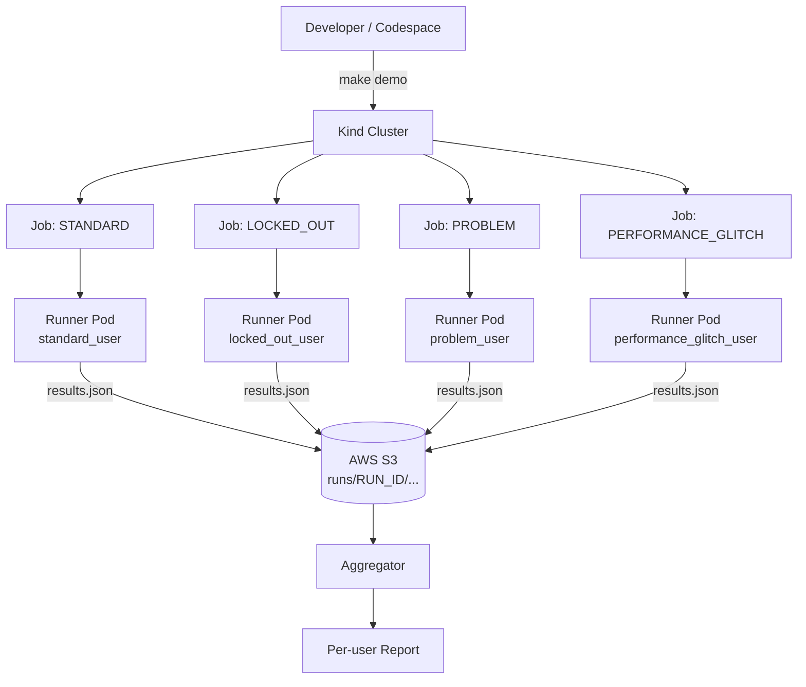

# k8s-test-runner

> Distributed Playwright test execution on Kubernetes — parallel Jobs, per-user contract testing, S3-backed result aggregation, fully reproducible in a Codespace.

[]() []()

---

## What this is

A test execution platform that runs Playwright end-to-end tests in parallel as Kubernetes Jobs, with each pod testing a different Sauce demo user persona, uploading its results to S3, and an aggregator producing a unified per-user report. The same workload pattern is designed to deploy to AWS EKS in Phase 2 (Weeks 4-5, not yet implemented).

This is a **portfolio project** demonstrating senior SDET / test infrastructure engineering competencies — not just test authorship, but the test infrastructure that makes large-scale automation viable.



## Quick demo

The fastest way to see this run: **open in a GitHub Codespace** (see [Why Codespaces](#why-codespaces-the-honest-version)) and run:

```bash
make doctor   # verify all tools and credentials are in place
make demo     # full pipeline end-to-end
```

The Makefile target builds the runner image, creates a Kind cluster, loads the image, creates a Kubernetes Secret with AWS credentials, applies four parallel Jobs (one per user persona), waits for all to complete, and runs the aggregator. Total runtime is roughly 3-5 minutes on a 2-core Codespace.

Expected output:

```
Per-user breakdown:
───────────────────────────────────────────────────────
  STANDARD              ✓ 4 passed, 0 failed, 0 skipped  (12.3s)
  LOCKED_OUT            ✓ 1 passed, 0 failed, 3 skipped  (5.1s)
  PROBLEM               ✓ 3 passed, 1 failed, 0 skipped  (13.4s)
  PERFORMANCE_GLITCH    ✓ 4 passed, 0 failed, 0 skipped  (18.2s)
───────────────────────────────────────────────────────
Total: 12 passed, 1 failed, 3 skipped
```

To tear down:

```bash
make clean         # delete the Jobs
make cluster-down  # delete the Kind cluster
```

## What this demonstrates

- **Kubernetes primitives:** Jobs with `backoffLimit`, `ttlSecondsAfterFinished`, downward API for `POD_NAME`, Secrets, restart policies, env-based parameterization
- **Distributed test execution:** Fan-out via parallel pods, fan-in via S3, shared run identifier across pods for clean aggregation
- **Contract-driven testing:** Per-user expectation contracts; tests assert behavior matching each user's documented contract rather than running identical assertions for all users
- **AWS integration:** S3 bucket as the results store, IAM user scoped to least-privilege `s3:PutObject` on a single bucket
- **Container engineering:** Docker image with non-root runtime user, output directory separated from application code for clean volume mounts, layer-cached dependency installation
- **Reproducibility:** Devcontainer + Codespaces config so anyone can spin up an identical environment without installing anything locally
- **Production patterns awareness:** Decoupled storage from compute, principle of least privilege for cloud credentials, deliberate migration path from static credentials (Phase 1) to IRSA (Phase 2)

## Architecture

The system has three logical components:

**Runner** ([`runner/`](runner/))
A containerized Playwright test environment that reads `SAUCE_USER` from the environment, runs the test suite against the [Sauce Labs demo site](https://www.saucedemo.com) as that user, and uploads its JSON results file to S3 under `runs/{RUN_ID}/{SAUCE_USER}/{POD_NAME}/results.json`. The entrypoint runs Playwright, captures its exit code, runs the upload regardless of test outcome, then exits with Playwright's original code — failed test runs are precisely the ones whose results you most want captured.

**Orchestration** ([`k8s/runner-job.template.yaml`](k8s/runner-job.template.yaml))
An envsubst-templated Kubernetes Job manifest, rendered once per user persona (4 Jobs total). Each pod receives a unique `POD_NAME` via the downward API and the shared `RUN_ID` injected as an env var. AWS credentials are injected as environment variables from a K8s Secret (Phase 1 pattern); the EKS path will swap this for IRSA.

**Aggregator** ([`runner/aggregate-results.js`](runner/aggregate-results.js))
A Node script that lists S3 objects under a run's prefix, downloads each pod's results, parses Playwright's stats, and prints a unified per-user pass/fail summary. Designed to run independently against any historical run by `RUN_ID` — useful for re-analyzing past runs without re-executing tests.

## Repository layout

```
k8s-test-runner/
├── .devcontainer/             # Codespaces config
│   ├── devcontainer.json
│   └── setup.sh
├── runner/                    # Playwright test runner
│   ├── Dockerfile             # non-root pwuser, separate output dir
│   ├── entrypoint.sh          # runs tests + uploads to S3 regardless of outcome
│   ├── upload-results.js      # S3 uploader for one pod's results
│   ├── aggregate-results.js   # cross-pod aggregator
│   ├── package.json
│   ├── playwright.config.js
│   └── tests/
│       ├── login.spec.js      # parameterized by SAUCE_USER
│       ├── inventory.spec.js  # cart & inventory tests per user
│       └── fixtures/
│           └── users.js       # per-user expectation contracts
├── k8s/
│   └── runner-job.template.yaml  # envsubst-templated Job (one per user)
├── scripts/
│   ├── kind-up.sh
│   ├── kind-down.sh
│   ├── build-and-load.sh
│   ├── create-secret.sh       # creates K8s Secret from local AWS creds
│   ├── run-jobs.sh            # renders 4 Jobs, applies them, waits for completion
│   └── doctor.sh              # health check
├── docs/
│   ├── AWS_SETUP.md           # one-time AWS setup walkthrough
│   ├── CODESPACES_SETUP.md    # Codespaces + VS Code Desktop setup
│   └── WEEK3.md               # Week 3 implementation details
├── Makefile
└── README.md
```

---

## Why Codespaces (the honest version)

This project originally targeted a local Mac development loop — install Kind, Docker Desktop, kubectl, the AWS CLI, run `make demo`. Partway through Phase 1, that plan stopped working.

**The symptoms:** my development Mac was running tight on disk — single-digit GB free. Docker Desktop allocates a virtual disk for all its container storage; once that fills up, Kind's image-loading operations start failing in surprising ways. I hit several `input/output error` failures while running `kind load docker-image` for the Playwright base image (which is ~3.5 GB extracted). Each failure required clearing Docker's state and rebuilding from scratch — half-hour recovery cycles that didn't actually fix the underlying constraint.

**What I tried first:** clearing Docker's cache (`docker system prune -a --volumes`), increasing Docker Desktop's disk allocation, and combinations thereof. These bought temporary relief but didn't address the root cause: a 64-GB Docker virtual disk on a Mac with ~10 GB free is going to choke on multi-gigabyte image operations no matter how the allocations are tuned. I was past the resource limits of the machine, not past the limits of the configuration.

**The realization:** the project was supposed to be a portfolio piece, which means "someone else should be able to clone it and run `make demo`." If it only ran on a beefier Mac than mine, I'd have shipped a project I couldn't actually demo. That reframed the problem: I didn't need *my laptop* to run this. I needed *a reproducible environment* that anyone — including me — could spin up on demand.

**The fix: GitHub Codespaces.** I added a `.devcontainer/devcontainer.json` configuring a container with Docker-in-Docker, Kind, kubectl, the AWS CLI, Terraform, and Node already installed. A 2-core Codespace is genuinely sufficient because the host is doing nothing else — no browser, no Slack, no IDE eating disk space. `make demo` runs in 3-5 minutes reliably, and the workflow is identical whether I'm at my desk or on a different machine.

**Why this is actually better than buying a bigger Mac:**
- **Reproducibility.** Anyone reading this README can launch a Codespace and run `make demo` in five minutes — including a hiring manager who wants to see the project actually work, not just trust my screenshots.
- **Cleanliness.** Every Codespace starts from a defined baseline. No leftover Kind clusters from yesterday, no stale Docker layers, no "works on my machine" caveats.
- **Portability.** I can develop from any machine. The dev environment lives in the repo, not on a specific laptop.

The takeaway: an "infrastructure problem" surfaced an infrastructure decision. The right answer wasn't "buy more hardware" — it was "treat the dev environment as code."

---

## Setbacks and challenges

Things that broke or surprised me during the build, in roughly the order I hit them.

### 1. Docker disk pressure on a near-full Mac

Already covered above. The short version: I underestimated how much working space `kind load` of a multi-GB image actually needs, and how poorly Docker Desktop on macOS handles disk pressure. Repeated `input/output error` failures forced me to confront the dev environment as a real engineering problem, not an afterthought. Resolved by moving to Codespaces.

### 2. Non-root containers and output directory permissions

The Playwright base image conveniently provides a `pwuser` non-root user, and dropping to it in the Dockerfile is good production hygiene — Pod Security Standards generally require non-root. But the first version of my Dockerfile created the output directory at `/test-output`, and Playwright would crash on startup with `EACCES: permission denied, rmdir '/test-output'`.

The cause: Playwright tries to remove its output directory at the start of each run. To `rmdir` a directory on Linux, you need write permission on the **parent** directory, not on the directory itself. `/test-output` was created at the filesystem root, where `pwuser` has no write access.

The fix: create the output as `/test-output/playwright` instead, and `chown -R pwuser /test-output`. Now `pwuser` owns both the target directory and its parent, so the rmdir succeeds. Small detail, real Linux gotcha — I'd not internalized that rmdir's permission check works on the parent before this.

### 3. The "results uploaded but tests failed" reporting trap

The first version of my entrypoint ran Playwright, captured the exit code, and only uploaded results to S3 if tests passed. This is exactly backwards — **failed test runs are the ones whose results you most want to capture**. I rewrote the script to upload regardless of exit code, then exit with the original Playwright exit code afterward so the Job status still reflects pass/fail correctly.

This is a small thing but it's the kind of detail I now reflexively check in any test-result-capture code: separate the *recording* of an outcome from the *propagation* of that outcome. The Job's success/failure should reflect the tests; the upload step should be independent of that signal.

### 4. K8s Secrets vs IRSA — and why this is fine for Kind but wrong for EKS

For the Kind path, AWS credentials live in a K8s Secret and get injected as environment variables in the runner pods. This works, but it has the classic problems of static credentials: they don't rotate, they live in cluster state (plaintext in etcd by default), and any compromised pod has them.

I deliberately kept this pattern for Phase 1 because Kind doesn't have OIDC integration, so IRSA isn't available locally. The Phase 2 plan explicitly swaps this for IRSA, which is the production-correct pattern: short-lived credentials scoped to a Service Account, no long-lived secrets in cluster state, automatic rotation. Calling out the difference is more honest than pretending the Phase 1 path is production-ready.

### 5. Module resolution and file placement in Node

I initially placed the aggregator script in `scripts/aggregate-results.js`, conceptually grouping it with other orchestration scripts. The aggregator depends on `@aws-sdk/client-s3`, which is in `runner/package.json` → `runner/node_modules`. Running the script failed with `MODULE_NOT_FOUND` because Node resolves modules by walking up from the **script's location**, not from where you invoked it.

The fix was to move the file: `git mv scripts/aggregate-results.js runner/aggregate-results.js`. Once the script lives next to the `node_modules` directory that owns its dependencies, resolution just works.

The lesson: **in Node, file placement determines dependency resolution.** Fighting that with directory tricks gets messy. Putting scripts in or under the directory that owns their `node_modules` is the right design, even when "scripts" feels like it should be its own category.

---

## What's not here (and why)

This project ships **Phase 1 Weeks 1-3: the Kind-based local development path with S3 results aggregation**. The remaining Phase 1 work and all of Phase 2 are designed but not yet implemented:

**Week 4-5: EKS deployment via Terraform.** A real EKS cluster with Terraform-managed infrastructure, IRSA-based credentials, multi-arch images pushed to ECR, and the runner Job deployed to managed nodes. I'm deferring implementation for two reasons:

1. **Cost discipline.** A live EKS cluster runs ~$0.20/hour while up (control plane + worker + NAT gateway). For a portfolio project that's only demoed occasionally, the Kind path proves out the same Kubernetes patterns without the burn rate.
2. **Sequenced learning.** I'm new to Terraform and want to ramp up on it deliberately. Week 4 is dedicated to Terraform fundamentals before applying them to EKS in Week 5.

**Week 6-7: CI workflow + polish.** A GitHub Actions workflow that spins up Kind in CI, builds the image, runs the Job, and verifies completion on every PR. Plus an architecture diagram refresh and a final pass on the README.

## Future direction (if I had unlimited resources)

In rough priority order:

1. **Provision the EKS path for real.** Stand up the Terraform from Week 5's design, push the multi-arch image to ECR, wire up IRSA, run the demo end-to-end on managed nodes. Validate every claim the Phase 2 plan makes.
2. **Switch from one-Job-per-user to indexed Jobs.** Replace the envsubst-templated 4-Job pattern with `completionMode: Indexed` and `JOB_COMPLETION_INDEX`. The current pattern is more readable (`kubectl get jobs` shows each user by name), but indexed Jobs are more idiomatic for sharded workloads.
3. **Add an in-cluster registry for fast iteration.** Replace `kind load` with a local registry that Kind can pull from, eliminating the slow image-load step from the dev loop. There's a [well-known Kind recipe](https://kind.sigs.k8s.io/docs/user/local-registry/) for this.
4. **Real CI on PRs.** GitHub Actions workflow that runs the full `make demo` against Kind on every PR. Adds confidence that the demo path doesn't bitrot.
5. **Better reporting.** The aggregator currently prints a stdout summary. A richer artifact would be an HTML report committed to a `results/` branch per run, with per-pod timing breakdowns, flake detection across multiple runs of the same test, and links to Playwright traces stored in S3.
6. **Smarter test distribution.** Right now, distribution is by user persona — meaningful for contract-driven testing but not a scaling primitive. A future version would combine per-user contract testing with per-file sharding **within** each user's run, using historical test timing data to balance shards by expected duration. This is what production test infrastructure at scale (Buildkite Test Engine, CircleCI test splitting) actually does.
7. **Spot/preemptible node support.** Test runs are interruptible workloads — a perfect fit for spot instances. The Job's `backoffLimit` already handles individual pod retries; with proper pod disruption budgets and a cluster-autoscaler aware of spot pricing, test infrastructure could run at 60-80% lower cost.

The pattern in this list is consistent: the project shows the *primitives*, and most of the future work is about applying production-grade refinements (cost optimization, smarter scheduling, real observability) on top of those primitives. That's the trajectory I'd want to demonstrate next.

## Roadmap

- [x] **Week 1** — Kubernetes ramp-up (Kind, kubectl, Jobs concept)
- [x] **Week 2** — Containerized Playwright runner on local Kind
- [x] **Week 3** — Parallel execution + AWS S3 results aggregation
- [ ] **Week 4** — Terraform ramp-up (foundation for EKS)
- [ ] **Week 5** — Terraform-managed AWS EKS deployment with IRSA + ECR
- [ ] **Week 6–7** — GitHub Actions CI, architecture diagrams, polish

Each completed weekly milestone is tagged in git (`week-2-complete`, `week-3-complete`, etc.).

## Local development (without Codespaces)

If you do want to run this locally, you'll want:

- **At least 30 GB free disk space.** Docker Desktop's virtual disk plus the Playwright image plus a Kind cluster needs real headroom.
- **At least 8 GB RAM**, preferably 16 GB.
- Docker Desktop, Kind, kubectl, Node 20+, AWS CLI configured
- An S3 bucket and IAM user with `s3:PutObject` on that bucket; see [`docs/AWS_SETUP.md`](docs/AWS_SETUP.md)

Then `make demo` works the same as in a Codespace.

If you're on Apple Silicon, edit `scripts/build-and-load.sh` to add `--platform linux/arm64` to the `docker buildx build` command.

---

## About

Built by David Lee, Senior SDET. Project demonstrates production-pattern test infrastructure thinking — extending senior SDET experience at Amazon Robotics, Doble Engineering, and Walmart Advanced Systems & Robotics into Kubernetes-native distributed execution.

See also: [LinkedIn](https://linkedin.com/in/jaehyun-david-lee).

## License

MIT — see [LICENSE](LICENSE).